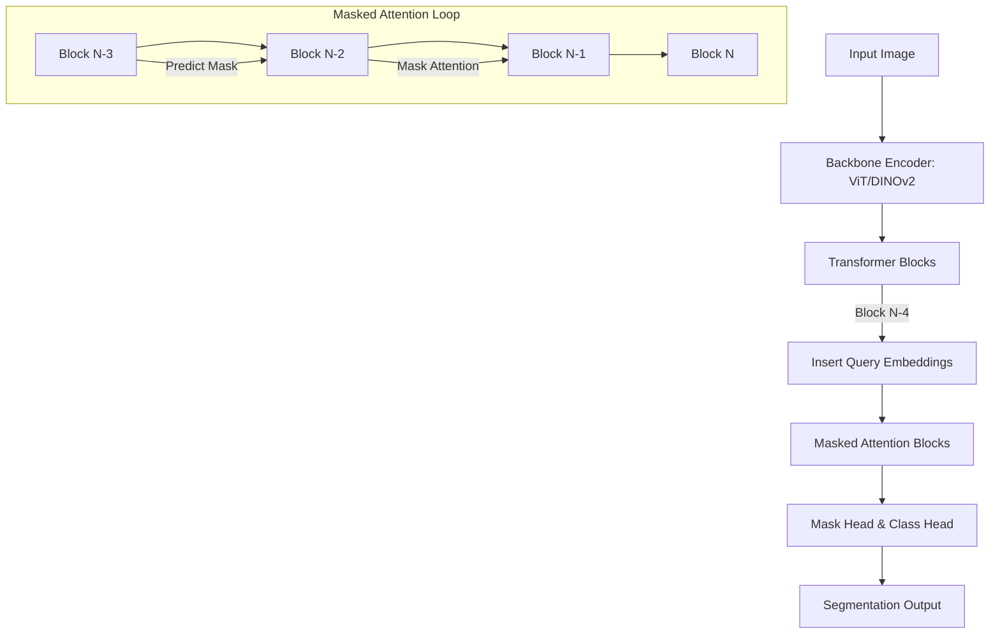
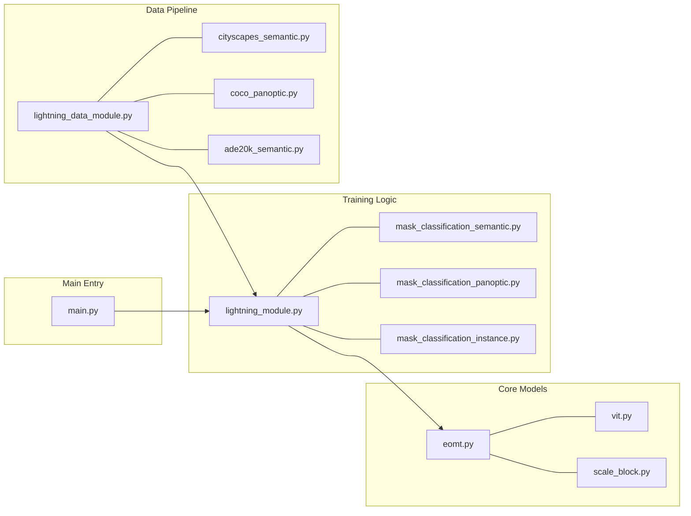

# EoMT (Encoder-only Mask Transformer) Codebase Guide

This guide provides a comprehensive overview of the `eomt` project, a transformer-based framework for panoptic, semantic, and instance segmentation using an encoder-only architecture.

---

## 1. System Architecture

The EoMT architecture leverages a Vision Transformer (ViT) backbone and introduces learnable queries directly into the transformer sequence.

### High-Level Flow


---

## 2. Directory Structure & File Documentation

### Root Directory
| File | Description |
| :--- | :--- |
| `main.py` | Main entry point using `LightningCLI`. Handles training, validation, and testing subcommands. |
| `Step4.ipynb` | Tutorial notebook for cross-domain evaluation (e.g., COCO model on Cityscapes). |
| `inference.ipynb` | Notebook for running inference on single images. |
| `requirements.txt` | Project dependencies. |

---

### `models/` - Core Architecture
Contains the neural network definitions.

| File | Description |
| :--- | :--- |
| `__init__.py` | Package initialization. |
| `eomt.py` | Implementation of the `EoMT` class. Handles query insertion, masked attention logic, and the forward pass. |
| `vit.py` | Vision Transformer backbone wrapper. Supports DINOv2 and other ViT variants. |
| `scale_block.py` | Upsampling modules that refine low-res patch features into high-res segmentation masks. |

---

### `training/` - Task Logic & Training Loops
Extends `LightningModule` to implement task-specific behavior (Losses, Metrics, Logging).

| File | Description |
| :--- | :--- |
| `__init__.py` | Package initialization. |
| `lightning_module.py` | Base class for all training tasks. Implements optimizer setup, learning rate scheduling, and common logging. |
| `mask_classification_semantic.py` | Logic for semantic segmentation (e.g., Cityscapes). Handles sliding window inference. |
| `mask_classification_panoptic.py` | Logic for panoptic segmentation. Handles merging semantic and instance predictions. |
| `mask_classification_instance.py` | Logic for instance segmentation. |
| `mask_classification_loss.py` | Combined loss function: Binary Cross-Entropy (BCE) + Dice Loss for masks, and Cross-Entropy for classes. |
| `two_stage_warmup_poly_schedule.py` | Custom LR scheduler with a warmup phase followed by polynomial decay. |

---

### `datasets/` - Data Loading & Augmentation
Handles various dataset formats and prepares them for the model.

| File | Description |
| :--- | :--- |
| `__init__.py` | Package initialization. |
| `lightning_data_module.py` | Base class for data modules, ensuring consistent loading across tasks. |
| `dataset.py` | Generic dataset class that handles image loading and annotation parsing. |
| `cityscapes_semantic.py` | Specific loader for Cityscapes semantic segmentation. |
| `coco_panoptic.py` | Loader for COCO Panoptic dataset. |
| `coco_instance.py` | Loader for COCO Instance segmentation. |
| `ade20k_semantic.py` | Loader for ADE20K semantic segmentation. |
| `ade20k_panoptic.py` | Loader for ADE20K panoptic segmentation. |
| `transforms.py` | Data augmentation pipeline (Random Resize, Cropping, Color Jitter). |

---

### `eval/` - Evaluation & Benchmarking
Post-processing and specialized evaluation scripts.

| File | Description |
| :--- | :--- |
| `dataset.py` | Evaluation-specific dataset wrapper. |
| `erfnet.py` | Baseline model (ERFNet) for comparison. |
| `erfnet_nobn.py` | ERFNet variant without Batch Normalization. |
| `eval_cityscapes_color.py` | Generates color-mapped prediction images for Cityscapes. |
| `eval_cityscapes_server.py` | Formats results for submission to the Cityscapes official evaluation server. |
| `eval_iou.py` | Calculates Mean Intersection over Union (mIoU). |
| `eval_forwardTime.py` | Benchmarks inference speed. |
| `evalAnomaly.py` | Scripts for anomaly detection benchmarks. |
| `iouEval.py` | Utility for computing IoU metrics. |
| `transform.py` | Evaluation-time image transformations. |

---

## 3. Visualization: Codebase Map



---

## 4. Mathematical Foundations

The EoMT loss function for a set of predicted masks $M$ and ground truth masks $G$ is defined as:

$$L_{total} = \lambda_{mask} L_{mask}(M, G) + \lambda_{class} L_{class}(P, C)$$

Where $L_{mask}$ is a combination of Focal Loss and Dice Loss:

$$L_{mask} = \alpha L_{focal} + \beta L_{dice}$$

The Dice Loss for a predicted mask $m$ and ground truth $g$ is:

$$L_{dice} = 1 - \frac{2 \sum m \cdot g}{\sum m^2 + \sum g^2}$$

---

## 4. Key Workflows

### Running Training
```bash
python main.py fit --config configs/dinov2/cityscapes/semantic/eomt_base_640.yaml
```

### Running Evaluation
```bash
python main.py validate --config configs/dinov2/cityscapes/semantic/eomt_base_640.yaml --ckpt_path path/to/checkpoint.ckpt
```

### Inference via Notebook
Use `inference.ipynb` to load a model and run:
1. `load_eomt_model(...)`
2. `model.window_imgs_semantic(image)` for high-res images.
3. Visualize using `plt.imshow`.
